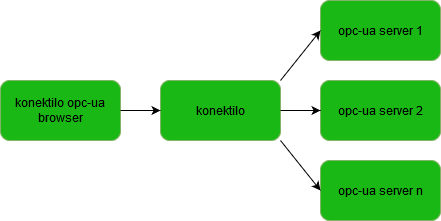

# THIS IS A BETA VERSION!
# konektilo opc-ua browser
The konektilo opc-ua browser is an ionic app which you can use with konektilo to explore the structure of you connected opc-ua servers.
The app is developed with ionic 5.
Below you can see an overview of the different components of konektilo.
If you would like to test and include konektilo as RESTful api for opc-ua you can find the free version here: ```https://konektilo.de/testuser```



# getting started
* tbd
